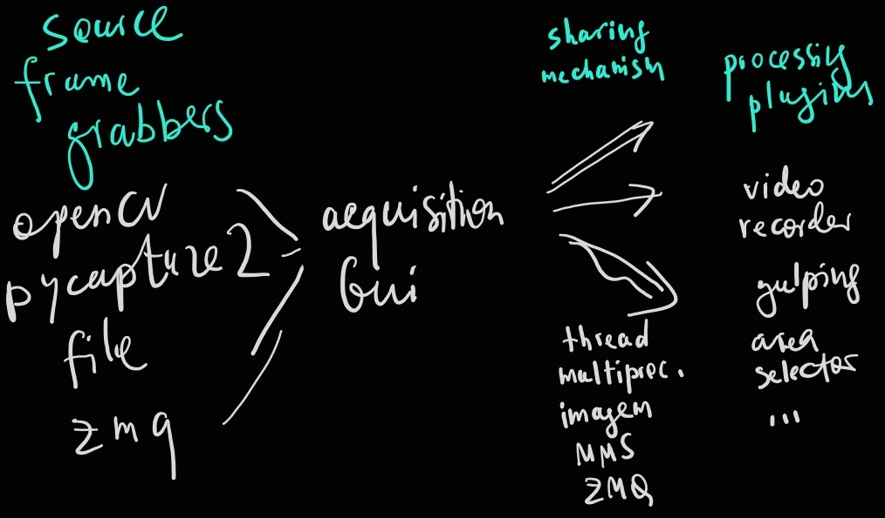

This repository offers a versatile software solution for image frame acquisition from various sources (frame grabbers, files, ZMQ inputs). It then facilitates frame sharing through Python's multithreading and multiprocessing, imagem tools, MMS Windows, and ZMQ. Fianlly, it provides an expandable plugin system for presenting and analyzing the acquired frames. In addition, it works as the Module Conductor (MC) module.

### Supported modes
* **Sources**: opencv cameras/files, tiff files, pycapture2 cameras (FLIR), PCO cameras, SVS cameras
* **Frame sharing**: Python's multithreading/multiprocessing, imagem, MMS, ZMQ
* **Plugins** : frame viewer, video recorder, zebrafish gulping, zebrafish heart rate

Note that, at the moment, the GUI implementation is done with PyQt5 due to the fact that the last provided pycapture2 implmenetation is for python 3.6, and I couldn't resolve the conda environment for python 3.6, PyQt6, pycapture2, and opencv at the same time.

### Some ways for starting the camera GUI:
The application includes relative imports which require treating the whole thing as a package. Assuming the conda environment for the cameras called `cameras` has been already created:\
* Method 1. Run\
`run_camera_app.bat`
* Method 2.
    * `cd` to the parent folder of the `cameras` package
    * `conda run -n cameras python -m cameras`\
    OR
    * `conda activate cameras`\
    cd to the parent folder of cameras\
    `python -m cameras`
* The software can be started with parameters (with the same preparation as above):
    `python -m cameras --grabber pycapture2 --width=640 --height=640 --mode=0 --fps=90 --offsetX=500 --offsetY=500`

### The instructions for different cameras:
**opencv** : The cameras which can be controlled with generic drivers work out of the box. The frame grabber and the associated `settings window` GUI is located under `grabbers\opencv\`\
**pycapture2** : See `grabbers\pycapture2\docs\pycapture2.md`

### Conda environment installation:
As mentioned above, this python software relies on the presence of PyQt5, opencv, and pycapture2 packages. If there is no need to operate Flir cameras though, the latter package can be absent.

If you want to reproduce the working conda enviroment which worked for us with all cameras, we provide the `yml` file which can be used to reproduce the full environment as follows:\
`conda env create -n new-environment-name -f saved-environment.yml`

This installation won't include the `pycapture2` package though. Consult `pycapture2.md` (see above) for instructions on how to install it.

#### Troubleshooting

##### Qt Environment error:
After moving the .yml list for the conda environment, you'll likely get the following error:\
`qt.qpa.plugin: Could not find the Qt platform plugin "windows" in ""`
`This application failed to start because no Qt platform plugin could be initialized. Reinstalling the application may fix this problem. `

The reason for the error is that during Qt installation, in addition to the packages installed into the environment folder, Qt sets up Windows' Environment variables. To fix it temporarily, run from cmd:\
`set QT_PLUGIN_PATH=path-to-camera-environment\Library\plugins`
To fix permenantly:
-> Environment Variables... (bottom right of the `System Properties` window) -> `User Variables for ...` -> new variable `QT_PLUGIN_PATH`, variable value: same-path-as-for-the-temporarily-solution.